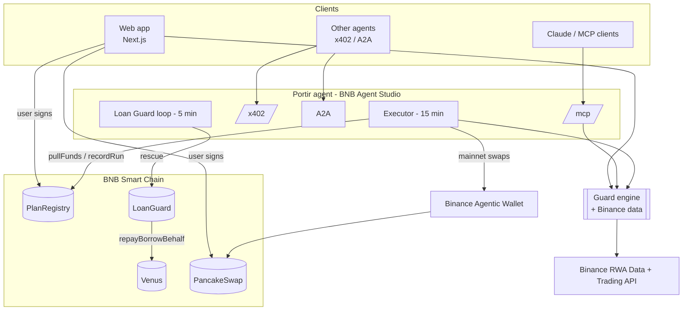

## No custodial backend

Plans and run history live in `PlanRegistry`. With the executor on Agent Studio and signing through wallets, a backend would only have been a database, and the chain already is one, with a public audit trail.

Two Next.js route handlers exist only because `binance.com` is unreachable from browsers in some regions and the Trading API needs a server-side key:

| Route | Does |
| --- | --- |
| `GET /api/quote` | Prices and history for the portfolio |
| `POST /api/buy` | Guard verdict plus approval and swap calldata (mainnet), or a keeper-signed quote (testnet). Nothing is sent from the server |
| `POST /api/agent` | Proxies the in-app chat to the agent's `/x402` face |
