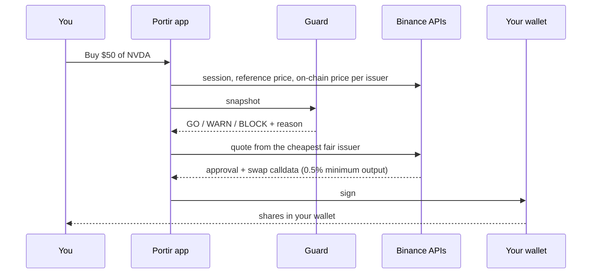
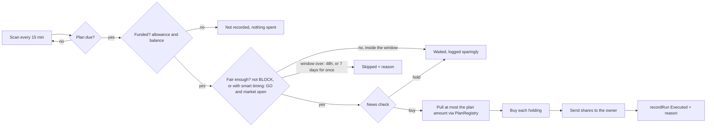
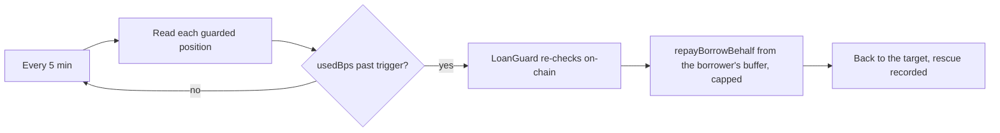

<Frame caption="Every plan and every loan has its own flow in the app">
  
</Frame>

## The building blocks

| Piece | Role |
| --- | --- |
| **Binance RWA Data API** | US session, halts, exchange reference price, issuer multipliers, catalog of 500+ stocks and ETFs |
| **Binance Trading API** | Executable quotes and swap calldata over PancakeSwap liquidity (user buys on mainnet) |
| **The Guard** | Pure verdict logic: GO / WARN / BLOCK with a reason |
| **PlanRegistry** | Plans, sell rules, funding pulls and run history. Holds no funds between calls |
| **LoanGuard** | Capped, on-chain-checked repayments of Venus loans from the borrower's buffer |
| **Portir agent** (BNB Agent Studio) | Executor every 15 min, Loan Guard loop every 5 min, MCP / x402 / A2A faces |
| **Binance Agentic Wallet** | The agent's hands on mainnet: MPC wallet with limits set in the Binance App |

## A manual buy

Nothing is sent from a server. The app only prepares calldata; your wallet signs.

## A plan run

<Frame caption="The same flow in the app: plan #13, AI & Semis, every node lit where the last run passed">
  
</Frame>

## A loan rescue

<Frame caption="The Loan Guard flow and the last rescue, as the borrower sees it">
  
</Frame>

<Note>
The agent decides; the contracts enforce. A leaked agent key can take at most one run's amount per due plan, and can only repay a borrower's own debt, capped. See the [security model](/learn/security-model).
</Note>
